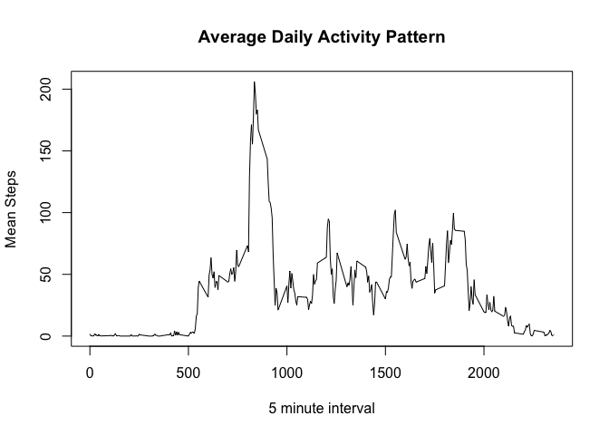

# Reproducible Research: Peer Assessment 1


###Loading the data
Loading the data, ignoring NA values, and putting it into a data frame.


```r
library (dplyr)
```

```
## 
## Attaching package: 'dplyr'
```

```
## The following objects are masked from 'package:stats':
## 
##     filter, lag
```

```
## The following objects are masked from 'package:base':
## 
##     intersect, setdiff, setequal, union
```

```r
library (ggplot2)

setwd("~/Projects/Reproducible Research/RepData_PeerAssessment1")
fileUrl <- "https://d396qusza40orc.cloudfront.net/repdata%2Fdata%2Factivity.zip"
temp <- tempfile()
filename = "activity.csv"
download.file(fileUrl, temp, method = "curl")
unzip(temp, filename)
data <- read.table(filename, header = TRUE, sep=",")
dateDownloaded <-date()
if(!exists("data")) {
        data <- read.csv(filename, header = TRUE, na.strings = "NA")
}
```
### A histogram of the total number of steps taken per day.

```r
dailysteps <- aggregate(steps ~ date, data, sum)
hist(dailysteps$steps, breaks = 20, main= "Total Steps Each Day", xlab= "Number of Steps")
```

<!-- -->

Results is the mean and median number of steps.

```r
meanstep <- as.integer(mean(dailysteps$steps))
medianstep <- median(dailysteps$steps)
```
The mean number of steps taken per day is 10766.  
The median number of steps taken per day is 10765.

### The Average Daily Activity Pattern
A time series plot of the 5-minute interval and the average number of steps taken averaged across all days.

```r
avgdailyptrn <- aggregate(steps ~ interval, data, mean)
plot(avgdailyptrn$interval, avgdailyptrn$steps, type="l", xlab= "5 minute interval", ylab="Mean Steps", main = "Average Daily Activity Pattern")
```

<!-- -->

Determine the maximum number of steps in a day.

```r
maxavgstep <- max(avgdailyptrn$steps)
maxint <- avgdailyptrn$interval[avgdailyptrn$steps==maxavgstep]
```

The time interval that contains the maximum number of steps 835.

### Imputing Missing Values
Calculate and report the total number of missing values in the dataset.

```r
nbrmissing <- sum(is.na(data$steps))
```
There are 2304 missing values in the dataset.

Filling in the missing data values by using the average of the interval from the Average Daily Activity Pattern. Here is a histogram of the new data without missing values.

```r
completedata <- transform(data, steps = ifelse(is.na(data$steps), avgdailyptrn$steps[match(data$interval, avgdailyptrn$interval)], data$steps))
ndailysteps <- aggregate(steps ~ date, completedata, sum)
hist(ndailysteps$steps, breaks = 20, main= "Total Steps Each Day", xlab= "5-minute Interval")
```

<!-- -->

```r
meanstepcomp <- as.integer(mean(ndailysteps$steps))
medianstepcomp <- as.integer(median(ndailysteps$steps))
```
The mean of the imputed data is 10766.
The median of the imputed data is 10766


```r
meandiff = meanstepcomp - meanstep
mediandiff = medianstepcomp - medianstep
```

This creates a a change of 0 from the original mean data and a 1 step change to the median.
Imputing the data using mean values does not change the mean, but increases the median number of steps.


### Differences in Activity Patterns between weekdays and weekends.
Create a new factor variable with two levels to indicate a day as a weekday or weekend and plot the average number of steps taken per grouping.

```r
completedata$day <- weekdays(as.Date(completedata$date))
weekday = c("Monday", "Tuesday","Wednesday","Thursday", "Friday")
completedata$wday <- factor((completedata$day %in% weekday), levels=c(FALSE,TRUE), labels=c("weekend","weekday"))
wdailysteps <- aggregate(steps ~ interval + wday, completedata, mean)
g <- ggplot (wdailysteps, aes(interval, steps))
g+geom_line(color="steelblue")+facet_wrap(~wday, nrow = 2)+theme_bw()+labs(y="Number of Step") +labs(x="Interval") + labs(title= "Number of Steps by 5-minute Intervals ")
```

<!-- -->


